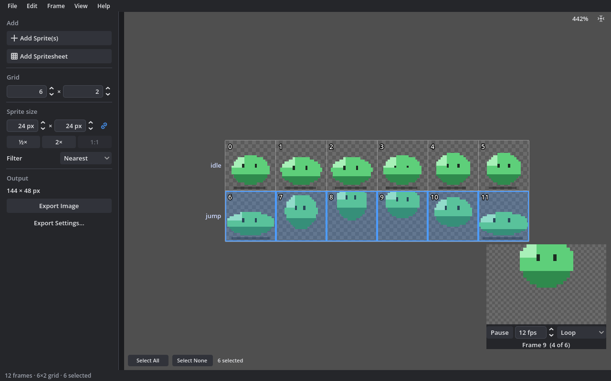
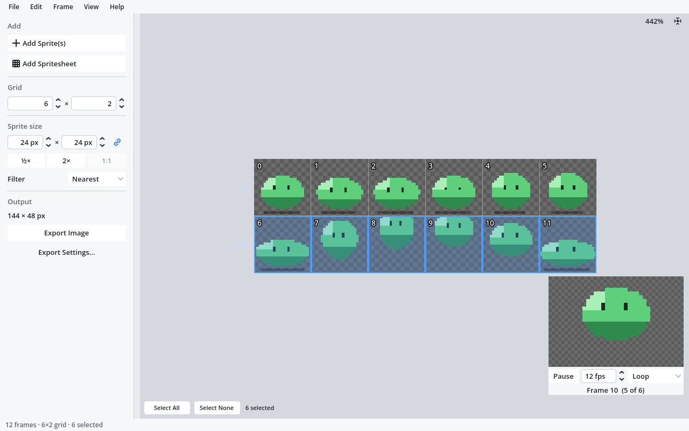

<p align="center"></p>

<h1 align="center">spritesheetbelli</h1>

<p align="center">Combine sprites into spritesheets and cut spritesheets into sprites.<br>
A small desktop tool made with Godot.</p>



## Features

- **Build sheets from sprites.** Add image files (PNG, JPG, WebP, animated GIF), whole
  folders or dropped files. They're
  sorted by name and placed in the first free cell, after the last frame or on a new row.
- **Cut sheets into frames.** The grid size is guessed from the file name
  (`hero_32x32.png`, `walk_8x2.png`) or from the gaps between sprites; offset and spacing
  handle sheets that aren't packed edge to edge.
- **Unpack packed sheets.** A TexturePacker or Aseprite JSON next to the image says where
  every frame is; trimmed and rotated frames are restored and tags become animations.
  Without one, the sprites are found by the transparent space around them.
- **Edit frames.** Drag to move or copy (Alt), flip, rotate, trim, remove a background
  colour, add an outline, replace, cut/copy/paste (also images copied in other apps),
  duplicate, insert or remove cells, insert, remove or reorder rows. Everything can be
  undone.
- **Line frames up.** Move frames inside their cells with the arrow keys in the move mode,
  or align them to an edge of their cells; trimming keeps every pixel where it was, so
  animations don't jump.
- **Resize without losing quality.** Sprites are always resized from the originals, with
  Nearest for sharp pixel art.
- **Animations:** make named animations from a range of cells or the selected frames,
  each with its own speed and loop, ping-pong or play-once, and frames that are held
  longer (`0-3, 4*2`); mirror walk_right into walk_left; preview them with onion skin
  and export them.
- **Name rows** as animations (idle, walk, jump); names are used in exports.
- **Export** the sheet as PNG, JPG or WebP; every frame as its own PNG with file names like
  `walk_{frame:2}`; a tightly packed atlas; or an animation as an animated GIF. One Export dialog shows only the settings
  that matter for what you export; padding, spacing and edge extrusion are there when an
  engine needs them.
- **Metadata for game engines:** TexturePacker-style JSON (with Aseprite-style tags), a
  Godot `SpriteFrames` resource with one animation per named row, or a libGDX / Spine
  `.atlas` for packed atlases.
- **Projects** (`.sbelli`) reopen exactly as they were, with frames at their original size.
- Light and dark themes, an accent colour, interface scaling and a keyboard shortcut for
  every action.

<details>
<summary>Light theme</summary>


</details>

## Download

Builds for Windows, macOS, Linux and the web are attached to each
[release](https://github.com/caleb-tognoli/spritesheetbelli/releases). The web version
runs in the browser: opening files uses the browser's file picker and saving downloads
the result.

### Publishing a release

Push a tag such as `v0.2.0`. The Release workflow builds every platform, attaches the
builds to a GitHub release and publishes the web version to GitHub Pages (set
*Settings > Pages > Source* to *GitHub Actions* once). To also publish on itch.io, add
the repository variable `ITCH_GAME` (like `your-name/spritesheetbelli`) and the secret
`BUTLER_API_KEY`.

## Keyboard shortcuts

Press **F1** in the app for the full list. The most useful:

| Action | Shortcut |
| --- | --- |
| Add sprites / spritesheet | Ctrl+I / Ctrl+Shift+I |
| Save project / Save As | Ctrl+S / Ctrl+Shift+S |
| Export / Export again | Ctrl+E / Ctrl+Shift+E |
| Undo / Redo | Ctrl+Z / Ctrl+Y or Ctrl+Shift+Z |
| Cut / Copy / Paste / Duplicate | Ctrl+X / Ctrl+C / Ctrl+V / Ctrl+D |
| Select all / none | Ctrl+A / Esc |
| Delete frames / Remove cells | Delete / Shift+Delete |
| Flip / Rotate | H, V / R, Shift+R |
| Trim transparent borders | T |
| Align in cell: top / bottom / left / right / centre | Alt+T / B / L / R / C |
| Move frames inside their cells (move mode) | Arrow keys (Shift for 8 pixels) |
| Name row | F2 |
| Insert / remove row | Ctrl+Insert / Ctrl+Shift+Delete |
| Move row up / down | Ctrl+Shift+Up / Ctrl+Shift+Down |
| Zoom / Actual size / Fit | Ctrl+= and Ctrl+- / Ctrl+0 / F |
| Select / move tool | Q / W |
| Animation preview | P |

In the preview: click selects, Ctrl+click toggles, Shift+click selects a range, drag on
empty space draws a selection box, drag frames to move them, click an empty cell to lock it
so added sprites skip it. Pan with the middle mouse button or Space+drag, zoom with the
wheel. Arrow keys move the selection, or in the move mode the selected frames. Right-click
for the Transform, Align in Cell and Rows submenus.

## Command line

The same packing and exporting can run in build scripts. Arguments go after `--`:

```sh
# Pack a folder of frames, 8 per row, with a Godot SpriteFrames file
spritesheetbelli --headless -- --pack ./frames --out hero.png --columns 8 --metadata godot

# Export a saved project, also writing every frame as its own PNG
spritesheetbelli --headless -- --export hero.sbelli --out hero.png --sprites ./hero_frames

# Cut a packed sheet into frames by the space around the sprites
spritesheetbelli --headless -- --cut packed.png --detect --sprites ./frames

# Pack a project tightly with a JSON file, and make a GIF of its walk animation
spritesheetbelli --headless -- --export hero.sbelli --out hero_atlas.png --atlas
spritesheetbelli --headless -- --export hero.sbelli --out walk.gif --animation walk --scale 4
```

Run with `--help` for every option. The exit code is 0 on success, 1 on errors and 2 on
bad usage.

## Building from source

1. Install [Godot 4.7](https://godotengine.org/download).
2. Open `project.godot` in Godot, or run it directly: `godot --path .`
3. To make builds, install the export templates and use Project > Export; the presets
   in `export_presets.cfg` are ready for Windows, macOS, Linux and the web.

### Tests and style

```sh
godot --headless --path . res://tests/test_runner.tscn   # exit code = failures
pip install "gdtoolkit==4.*"
gdlint scripts ui tests
gdformat scripts ui tests
```

CI runs the same on every push. Godot's script editor keeps indentation on blank lines,
so run `gdformat` before committing (or enable *Trim trailing whitespace on save* in the
editor settings).

### How it's organised

| Path | What's there |
| --- | --- |
| `scripts/resources/spritesheet.gd` | The spritesheet data and every edit |
| `scripts/document.gd` | The open document: file, unsaved state, undo history |
| `scripts/export/` | Exporting images, sprites, atlases and metadata |
| `scripts/import/` | Reading where frames are in packed sheets |
| `scripts/autoloaded/` | Global state, actions and shortcuts, settings, dialogs |
| `ui/main/` | The main window, menus and file handling |
| `ui/spritesheet_preview/` | The preview that draws and edits the grid |
| `tests/` | The test runner and tests |

