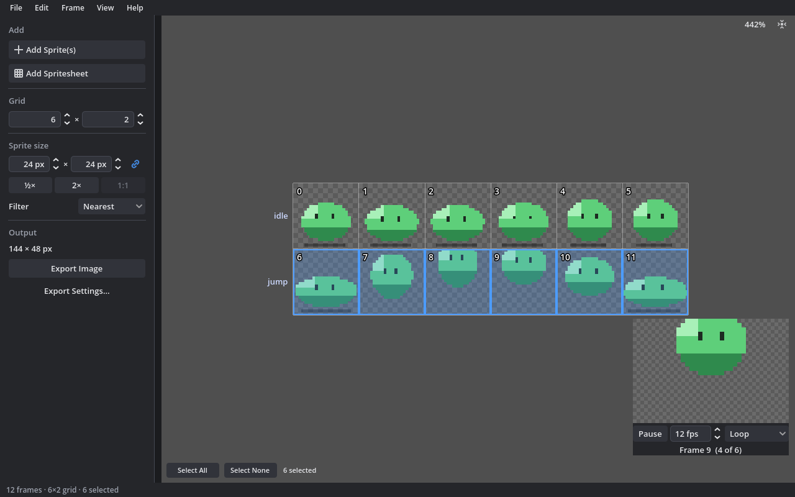
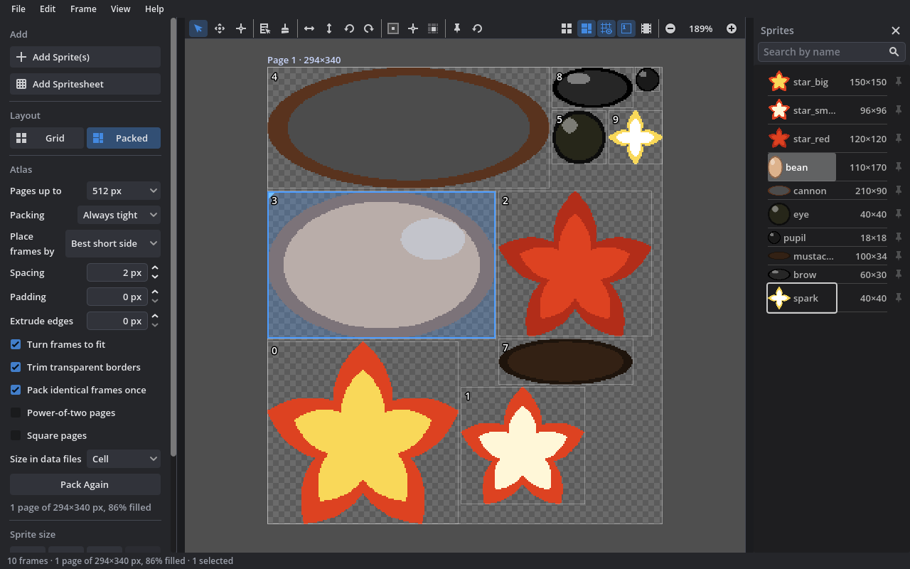
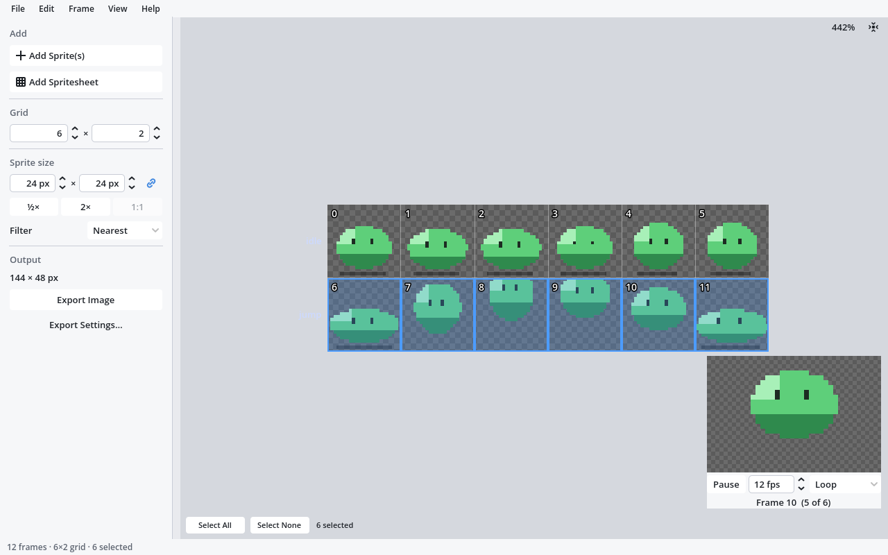

<p align="center"></p>

<h1 align="center">spritesheetbelli</h1>

<p align="center">Combine sprites into spritesheets and cut spritesheets into sprites.<br>
A small desktop tool made with Godot.</p>



## Features

- **Build sheets from sprites.** Add image files (PNG, JPG, WebP, animated GIF), whole
  folders or dropped files. They're
  sorted by name and placed in the first free cell, after the last frame or on a new row.
- **Cut sheets into frames.** The grid is set by columns × rows or by cell size in pixels,
  each following the other, and guessed from the file name (`hero_32x32.png`,
  `walk_8x2.png`) or from the gaps between sprites; offset and spacing handle sheets that
  aren't packed edge to edge, and pixels left over are pointed out. The window starts in
  Grid or Find sprites to match the sheet's layout, unless a data file comes with the
  image. The empty cells of an added sheet are locked so added sprites skip them, unless
  "Lock empty cells" is unticked. Sheets drawn on a solid colour, like magenta, have it
  made transparent before they're cut, so the grid is guessed from the gaps and frames
  come in clean; the eyedropper button in the toolbar picks another colour (from the
  colour picker, or by clicking the preview), sets how close a colour must be, or turns it
  off.
- **Unpack packed sheets.** A TexturePacker, Aseprite or Phaser JSON or a libGDX / Spine
  `.atlas` next to the image says where every frame is, on every page; trimmed and rotated
  frames are restored and tags become animations. Without one, the sprites are found by
  the transparent space around them, in boxes on the image you can move, resize, merge,
  delete or draw before adding them.
- **Packed layout.** Instead of a grid, frames can be laid out packed tightly on pages,
  like a texture atlas, and edited right there: drag frames anywhere (or onto a new page),
  pin them, pack again. An opened atlas keeps every frame where it is, so exporting it
  again after adding or editing frames keeps the places engines know. Page size, packing,
  spacing, padding, extrusion, turning frames to fit and trimming are in the sidebar;
  sharing identical frames and power-of-two or square pages are in Settings.
- **Pivots** (turn them on in Settings): the point engines anchor each frame at, set with
  the pivot tool or presets and exported where the format has them.
- **Edit frames.** The Select tool clicks and box-selects frames; the Move tool drags
  them, or copies them with Alt. Flip, rotate, trim, remove a background colour (from the
  eyedropper button in the toolbar, picked by clicking a frame and previewed on the
  selected frames, or every frame, until you Confirm), add an outline, replace,
  cut/copy/paste (also images copied in other apps), duplicate, insert or remove cells,
  insert, remove or reorder rows. Everything can be undone.
- **Stay linked to your art files.** Sprites and sheets remember the file they came from.
  When you save it again in your drawing program, spritesheetbelli asks whether to reload
  it, keeping the flips, trims, outlines and moves made here or going back to the file as
  it is; with several changed files, answer once for all of them. Sheets are cut again in
  the same places (data-file frames by name), GIF frames by number. Link a folder with Add
  Folder or by dropping it on the window: new images you save there are added
  automatically, deleted ones can be removed, and renamed ones stay linked.
- **Line frames up.** Move frames inside their cells a pixel at a time with the Move tool,
  or align them to an edge of their cells; trimming keeps every pixel where it was, so
  animations don't jump.
- **Resize without losing quality.** Sprites are always resized from the originals, with
  Nearest for sharp pixel art, and pixel-perfect zoom keeps every pixel the same size on
  screen.
- **Animations:** make named animations from a row, a column or the selected frames in a
  keystroke (F2, Shift+F2, Ctrl+F2), named after what their frames' names share, or from a
  range of cells, each with its own speed and loop, ping-pong or play-once. Put their
  frames together on a timeline by dragging them from the sheet or the Sprites panel,
  reordering them and setting how long each is shown, or type them by number or name
  (`0-3, 4*2`); mirror walk_right into walk_left; play them in the animation panel under
  the sheet, with onion skin, zoom, a scrub bar and a choice of background, and export
  them; only animations are exported as animations. Animations are named on the grid, next
  to or around their frames; the tag button in the toolbar chooses which. Click a name to
  play it, double-click to rename it, right-click for more.
- **Export** the sheet as PNG, JPG or WebP; every frame as its own PNG with file names
  like `{animation}_{animation_frame:2}` (walk_00, walk_01…); a tightly packed atlas, or
  its pages as images; an animation as an animated GIF, or a GIF of each animation; or
  GameMaker strips (`walk_strip8.png`, each animation's frames side by side). Images, data
  files, atlases and strips can be written at several scales at once (`hero.png`,
  `hero@2x.png`, pages `hero_0@2x.png`, strips `walk@2x_strip8.png`), each resized from
  the original frames with its own data file. A project keeps a list of exports, each with
  its settings and where it writes (relative to the project), so Export Again or the
  command line writes them all at once. The Export button sits at the top of the sidebar
  with the size of what it writes and how many exports there are, and the Export dialog
  shows only the settings that matter for each, with a Tokens… list for file names and the
  files it will write. Padding, spacing and edge extrusion are set in the sidebar, where
  the preview shows them, for the grid and the atlas.
- **Metadata for game engines:** TexturePacker-style JSON (hash or array, with
  Aseprite-style tags), a Phaser 3 multi-atlas, a libGDX / Spine `.atlas`, Sparrow /
  Starling XML, a Godot `SpriteFrames` resource with the sheet's animations (or every
  frame in one "default" animation when there are none), a Unity `.tpsheet`, a Cocos2d-x
  `.plist`, CSS or SCSS sprites (with the @2x image for high-density screens when exported
  at scales 1 and 2), and for grid sheets a Defold tile source, for a grid sheet or every
  page of a packed atlas, with pivots and turned frames where the format has them. Every
  data file comes from a template, and your own templates can add formats (see [Data file
  templates](#data-file-templates)). For Unity, install the free [TexturePacker Importer](
  https://assetstore.unity.com/packages/tools/sprite-management/texturepacker-importer-166
  41) package and export with the Unity data file into your project's Assets folder, next
  to the PNG: Unity cuts it into one sprite per frame, named after the frames, with their
  pivots, and cuts it again whenever you export over it.
- **Start screen.** With nothing open, the canvas shows your recent projects and sheets
  with thumbnails, to open with a click, and buttons to open a file or add sprites.
- **Crash recovery.** Unsaved work is copied every few minutes and offered on the start
  screen after a crash.
- **Projects** (`.sbelli`) reopen exactly as they were, with frames at their original
  size and the view you left them at.
- Light and dark themes, or the system's as it changes, an accent colour of your choice or
  the system's, interface scaling and keyboard shortcuts.

<details>
<summary>Packed layout</summary>


</details>

<details>
<summary>Light theme</summary>


</details>

## Download

Builds for Windows, macOS, Linux and the web are attached to each
[release](https://github.com/caleb-tognoli/spritesheetbelli/releases). The web version
runs in the browser: opening files uses the browser's file picker and saving downloads
the result.

### Publishing a release

Push a tag such as `v0.2.0`. The Release workflow builds every platform, attaches the
builds to a GitHub release and publishes the web version to GitHub Pages (set
*Settings > Pages > Source* to *GitHub Actions* once). To also publish on itch.io, add
the repository variable `ITCH_GAME` (like `your-name/spritesheetbelli`) and the secret
`BUTLER_API_KEY`.

## Keyboard shortcuts

Press **F1** in the app for every shortcut and what the mouse does in the preview; type in
its search box to find one by name or by key (like "ctrl+e"). Menus show each action's
shortcut, and toolbar buttons show it when hovered. **Ctrl+Shift+P** (or Ctrl+K, which
also works in browsers) opens the command palette: type part of an action's name, an
animation or an export, then press Enter.

## Command line

The same packing and exporting can run in build scripts. Arguments go after `--`:

```sh
# Pack a folder of frames, 8 per row, with a Godot SpriteFrames file
spritesheetbelli --headless -- --pack ./frames --out hero.png --columns 8 --metadata godot

# Export a saved project, also writing every frame as its own PNG
spritesheetbelli --headless -- --export hero.sbelli --out hero.png --sprites ./hero_frames

# Write every export the project has, as set up in the Export dialog
spritesheetbelli --headless -- --export hero.sbelli

# Write a 1x and a 2x sheet, each with its JSON file
spritesheetbelli --headless -- --export hero.sbelli --out hero.png --metadata json --scales 1,2

# A GIF of each animation, and GameMaker strips at 1x and 2x
spritesheetbelli --headless -- --export hero.sbelli --gifs ./gifs --strips ./gamemaker --scales 1,2

# Cut a packed sheet into frames by the space around the sprites
spritesheetbelli --headless -- --cut packed.png --detect --sprites ./frames

# Cut a sheet drawn on magenta into frames, keeping the magenta
spritesheetbelli --headless -- --cut hero_magenta.png --grid 8x2 --keep-background --sprites ./frames

# Pack a project tightly with a JSON file, and make a GIF of its walk animation
spritesheetbelli --headless -- --export hero.sbelli --out hero_atlas.png --atlas
spritesheetbelli --headless -- --export hero.sbelli --out walk.gif --animation walk --scale 4

# Keep an atlas's layout in a project, then write it for libGDX on pages of up to 1024 px
spritesheetbelli --headless -- --cut ui.atlas --layout packed --out ui.sbelli
spritesheetbelli --headless -- --export ui.sbelli --out ui.png --atlas-data atlas --max-size 1024

# Write the data file from a template of your own
spritesheetbelli --headless -- --export hero.sbelli --out hero.png --template my_engine.template
```

`--cut` makes a solid background colour, like magenta, transparent unless
`--keep-background` is given; `--tolerance` sets how close a colour must be. Run with
`--help` for every option. The exit code is 0 on success, 1 on errors and 2 on bad usage.

## Data file templates

Every data file is written from a template: plain text with Mustache-like tags. The
bundled ones are in `templates/`; put your own in the templates folder (Export dialog >
Open templates folder) to list them with the others, or pick one file with Custom
template. A template there with the file name of a bundled one (like `json.template`)
replaces it, marked "(yours)"; take it out to get the bundled one back. On the command
line a template's id is its file name without `.template` (`--metadata <id>`,
`--atlas-data <id>`), and `--template <file>` uses any file.

    {{name}}                 a value; nothing when it isn't set
    {{page.w}}  {{list.0}}   a value inside another
    {{.}}                    the current item, in a section over plain values
    {{name | json-escape}}   a value through filters, left to right
    {{#frames}}…{{/frames}}  once for every item of a list, or once when a value is set
    {{^frames}}…{{/frames}}  once when a value isn't set or a list is empty
    {{! comment }}           left out

Not set: nothing, false, empty text, an empty list. Numbers are always set, 0 too. Names
are looked up in the current item, then in the sections around it, then in the export.
Inside a list, `@index` is the item's position from 0, and `@first` and `@last` say
whether it's the first or the last: `{{#frames}}"{{name}}"{{^@last}}, {{/@last}}{{/frames}}`.
A line holding only sections and comments is left out, and so is the line break at the
very end. Filters: `json`, `json-escape`, `xml-escape`, `css-ident`, `tpsheet-escape`,
`lower`, `upper`, `pad N`, `plus N`, `minus N`, `times N`, `divide N`, `negate`,
`round N`; N is a number or a value's name (`{{x | plus w}}`).

A template starts with a header comment of `key: value` lines, up to an empty line:

    {{! my engine
    name: My engine
    extension: txt
    per_page: false
    rotation: none
    layouts: grid, packed
    }}
    {{#frames}}{{name}} {{x}} {{y}} {{w}} {{h}}
    {{/frames}}

`per_page`: a file for each page of an atlas. `rotation`: which way turned frames are
stored (clockwise, counter-clockwise, or none when the format can't say, and then frames
aren't turned). `layouts`: grid sheets, packed atlases or both. Without a header, the
extension comes from the file name (`list.csv.template`), else txt.

Values:
- the export: app, version, fps, frames, frame_count, animations, animation_count, pages,
  page_count, page, image, image_w, image_h, all_frames, related, and for a grid sheet
  columns, rows, cell_w, cell_h, padding, spacing, extrude;
- each frame: index, name, file_name, column, row, cell, page, x, y, w, h, packed_w,
  packed_h, rotated, trimmed, source_w, source_h, trim_left/top/right/bottom, has_pivot,
  pivot_x, pivot_y, pivot_px_x, pivot_px_y, duration;
- each animation: name, color (like Aseprite's `#rrggbbff`), fps, mode, loop, ping_pong,
  once, frames, frame_count, played_frames, from, to, direction, reversed, from_cell,
  to_cell; its frames also have relative_duration;
- each page: index, image, w, h, frames, frame_count, retina_image (its image at twice the
  size, in the 1x file of an export at scales 1 and 2).

At scales other than 1, every size and position (and a grid's cell_w, cell_h, padding,
spacing and extrude) is scaled.

The comments in `scripts/export/template_data.gd` describe each one.

## Building from source

1. Install [Godot 4.7](https://godotengine.org/download).
2. Open `project.godot` in Godot, or run it directly: `godot --path .`
3. To make builds, install the export templates and use Project > Export; the presets
   in `export_presets.cfg` are ready for Windows, macOS, Linux and the web.

### Tests and style

```sh
godot --headless --path . res://tests/test_runner.tscn   # exit code = failures
pip install "gdtoolkit==4.*"
gdlint scripts ui tests
gdformat scripts ui tests
```

CI runs the same on every push. Godot's script editor keeps indentation on blank lines,
so run `gdformat` before committing (or enable *Trim trailing whitespace on save* in the
editor settings).

### How it's organised

| Path | What's there |
| --- | --- |
| `scripts/resources/spritesheet.gd` | The spritesheet data and every edit |
| `scripts/resources/packed_layout.gd` | Where frames are in the packed layout |
| `scripts/frame_edits.gd`, `scripts/frame_source.gd` | Pixel edits that can be made again, and the files frames are linked to |
| `scripts/document.gd` | The open document: file, unsaved state, undo history |
| `scripts/export/` | Exporting images, sprites, atlases and metadata; the packer |
| `scripts/import/` | Reading where frames are in packed sheets |
| `scripts/autoloaded/` | Global state, actions and shortcuts, settings, dialogs |
| `ui/main/` | The main window, menus and file handling |
| `ui/spritesheet_preview/` | The preview that draws and edits the grid |
| `tests/` | The test runner and tests |

